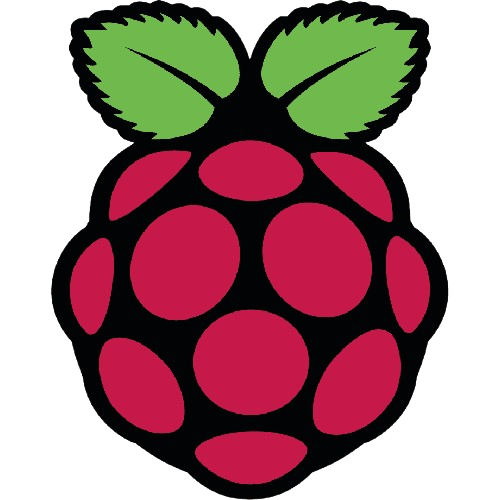
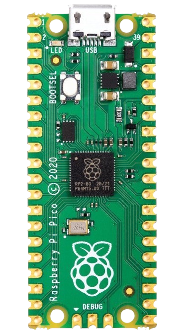

# Using Raspberry Pi Pico   

***Here we will make projects using the Raspberry Pi Pico microcontroller.*** 

   

---- 

Welcome to my GitHub repository dedicated to building exciting and practical projects using the **Raspberry Pi Pico**. This collection of projects is tailored to help both beginners and enthusiasts explore the potential of this microcontroller and dive into the world of embedded systems, IoT, and real-time applications.  

----  

## 🎯 Purpose of the Repository  
This repo aims to:  
- Showcase projects and implementations with the **Raspberry Pi Pico**.  
- Offer reusable code snippets and libraries for various peripherals and sensors.  
- Provide step-by-step guidance to help others learn how to work with the Raspberry Pi Pico.  
- Collaborate on new ideas and advancements in microcontroller-based development.  

## 🚀 Featured Projects  
Some of the key projects you'll find here:  
- **LED Blinking**: Learn how to control GPIOs.  
- **Sensor Integration**: Work with temperature, humidity, and pressure sensors.  
- **I2C/OLED Display**: Display data on an OLED screen via I2C.  
- **UART Communication**: Send and receive data via serial communication.  
- **Real-time System Stats Display**: Show CPU, RAM, and Disk usage stats from a PC on an OLED display using UART.  

> More projects and updates will be added regularly! [See the project list](#projects).  

## 🛠 Tools and Technologies  
- **Raspberry Pi Pico**  
- **MicroPython** and **C/C++ SDK**  
- **Thonny IDE**  
- **Modules** (OLED, sensors, Bluetooth, etc.)  

## 💡 How to Use This Repository  
- **Clone the repository** and start experimenting with the provided code.  
- **Review the README.md** files in each project folder for detailed instructions.  
- **Check out the Wiki** (coming soon) for deeper insights and tutorials.  
- **Contribute**: Found a bug or have a feature request? Feel free to open an issue or contribute with pull requests.  

## 📚 Documentation & Resources  
- **Raspberry Pi Pico Datasheet**: [Link to the datasheet](https://www.raspberrypi.org/documentation/microcontrollers/)  
- **Getting Started with Raspberry Pi Pico**: [Read the guide here](#getting-started-with-raspberry-pi-pico-development).  

## 💬 Connect & Contribute  
- **Open Issues**: If you encounter any problems or have suggestions, create an issue.  
- **Fork the Repo**: Want to contribute? Fork the repo and submit your pull requests!  
- **Follow**: Stay updated by watching the repo and following me on GitHub for new project releases!  

----  

  

# Getting Started with Raspberry Pi Pico Development  

This guide will help you set up your environment and get started with programming the Raspberry Pi Pico. We will cover:  
- Installing Thonny IDE for MicroPython development.  
- Writing your first program.  
- Flashing firmware and running code on the Pico.  
- Using the C/C++ SDK for more advanced projects.  

  

## 1. Installing Thonny IDE for MicroPython  

1. Visit the [Thonny Website](https://thonny.org/) and download the appropriate version for your system.  
2. Install and open Thonny.  
3. Set the interpreter of your choice  under `Tools > Options > Interpreter`.  

## 2. Writing Your First Program  

1. Connect the Pico to your PC via USB while holding the `BOOTSEL` button.  
2. Open Thonny and start writing.  
3. Save the script directly to the Pico.  

## 3. Using the C/C++ SDK  

1. Download and set up the Raspberry Pi Pico SDK following the [official guide](https://datasheets.raspberrypi.com/pico/getting-started-with-pico.pdf).  
2. Write your program in C/C++ using an IDE like Visual Studio Code.  
3. Build and flash the program to the Pico using the `pico-sdk` tools.  

  

# Projects  

1. [LED_Blink](./Projects/LED_Blink/LED_Blink.md)  
2. [Sensor_Integration](./Projects/Sensor_Integration/Sensor_Integration.md)  
3. [OLED_Display](./Projects/OLED_Display/OLED_Display.md)  
4. [System_Stats_Display](./Projects/System_Stats_Display/System_Stats_Display.md)  
5. [UART_Communication](./Projects/UART_Communication/UART_Communication.md)  

----  

## 🌟 Support the Project  

> If you find this repository useful, please **star it** ⭐ and **share it** 📨 with others! Your support helps keep this project going.  

----  

Let's learn and build together with the Raspberry Pi Pico! 👨‍💻👩‍💻  
